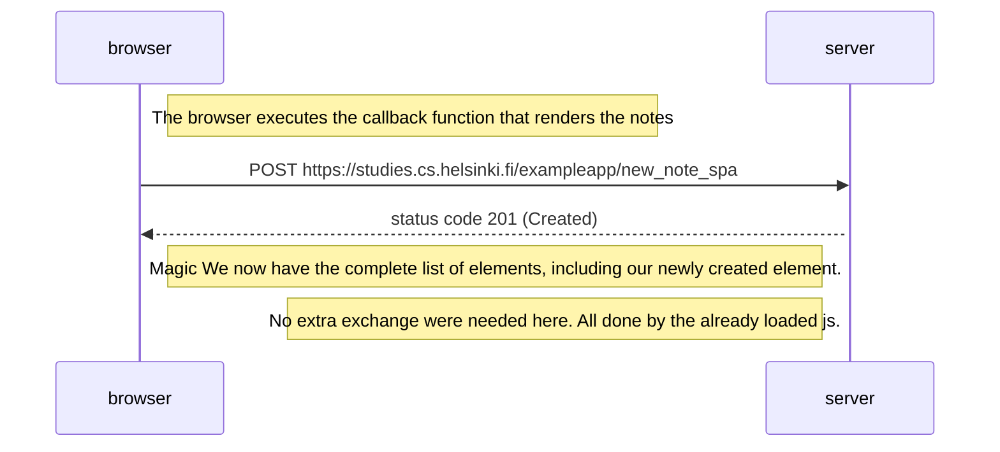

```mermaid
sequenceDiagram
    participant browser
    participant server

    Note right of browser: The browser executes the callback function that renders the notes

    browser->>server: POST 	https://studies.cs.helsinki.fi/exampleapp/new_note_spa
    activate server
    server-->>browser: status code 201 (Created)

    Note right of browser: Magic We now have the complete list of elements, including our newly created element.
    Note left of server: No extra exchange were needed here. All done by the already loaded js.

```